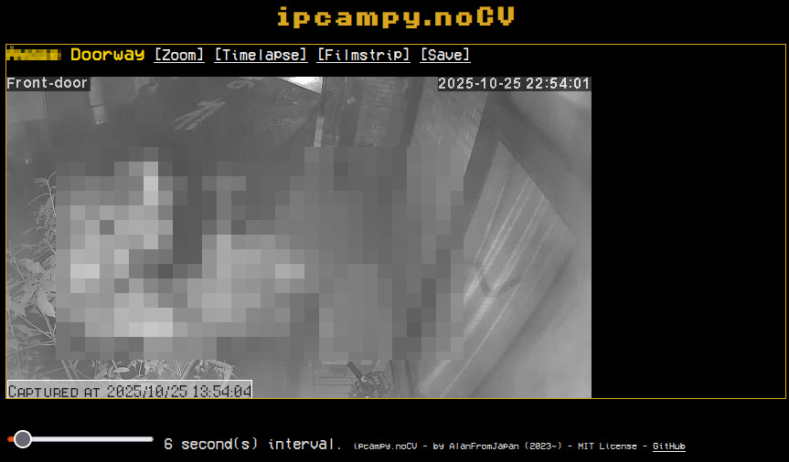

# ipcampy
Simplistic web interface to show capture of IP Camera. Should work with any RTSP compatible camera.
Uses FFmpeg (av) libs for the capture and **not** OpenCV (the trick being that getting it to work on small board computers is a pain).

Documentation details are here: http://electrogeek.cc/ipcampy.nocv.html



## What it can do
- [x] Login/password access (only one, view only anyway)
- [x] Show multiple camera "low resolution" pictures
- [x] Zoom on one camera (uses the "high resolution" stream)
- [ ] Save image still on server
- [ ] View saved images as Timelapse (pseudo movie) or Filmstrip (image per image)
- [x] Docker version


## Inspiration

- some guy doing brute force with av (FFMPEG) and **not** OpenCV https://gitlab.com/woolf/RTSPbrute/-/blob/master/rtspbrute/modules/attack.py
- the av lib https://pypi.org/project/av/

## Ideas and todos

- Use ffmpeg in the back to save image every x seconds and just show it with the site. No need to add a Python overlay if ffmpeg does it, and it does : `ffmpeg -i rtsp://my.camera.ip.address:554/2 -vf fps=1/5  camera%03d.jpg` will save 1 JPEG every 5 sec [as the doc says](https://trac.ffmpeg.org/wiki/Create%20a%20thumbnail%20image%20every%20X%20seconds%20of%20the%20video)

## Background batch explanation
If you choose so to activate them, the batch will do the follosing:
- Every x seconds, take a snapshot and save it in the target folder with a timestamped name
- Every day trash all the pictures older than 48h (so you keep at max 2 days of stills)

### Command details
`ffmpeg -nostdin -rtsp_transport tcp -rtsp_flags prefer_tcp -i rtsp://my.camera.ip.address:554/2 -vf "fps=1/5, drawtext=fontfile=/usr/share/fonts/TTF/Vera.ttf: text='%{localtime}': x=(w-tw)/2: y=h-(2*lh): fontcolor=white: box=1: boxcolor=0x00000000@1" -loglevel repeat+warning  -strftime 1 "camera_%Y%m%d_%H%M%S.jpg" > /tmp/ffmpeglogs.txt 2>&1 &`

- `-nostdin` ffmpeg won't expect stdin to be used so plays nicely in background mode
- `-rtsp_transport tcp -rtsp_flags prefer_tcp` are optional if you work on the same network, but ffmpeg uses UDP by default and in case your UDP traffic isn't routed properly (you have your cameras on a separate NW of your main NW as you should) then these 2 force the traffic to be on TCP. **BEWARE**: it must be *BEFORE* the `-i` in the parameters list [otherwise it's uneffective](https://github.com/kkroening/ffmpeg-python/issues/537)
- `-vf ` use multiple filters chained on the current stream (*filtergraph*, separated by a comma, collon are param separators). RTFM [on this page](https://ffmpeg.org/ffmpeg-filters.html) and [this one](https://trac.ffmpeg.org/wiki/FilteringGuide)
    - `drawtext=xxx` draws current time (as of server) on the image bottom-centered 
    - `fps=1/5` set frequence of capture in fps to 1 every 5 seconds (=0.2 fps) ~= drop every frame except 1 every n sec
- `-loglevel repeat+warning` duplicated consequent messages aren't displayer (only first line) and show warning or worse only
- `-s 320x200` force resize to given size
- `-strftime 1` enables [strftime](https://man7.org/linux/man-pages/man3/strftime.3.html) formatting on the output filename 

# Setup and maintenance 

## Installation as standalone app

1. `git clone https://github.com/AlanFromJapan/ipcampy.nocv.git`
1. `./install-dependencies.sh` to install the necessary Linux packages
1. create a `config.py` by copying `config.sample.py`
1. create the ssl keys in the ssl/ folder
1. From that point it should work if you run it with your user. Now from next line is how to make it a service-like
1. run the ./setup.sh ***or*** do the below 2 lines
    1. `sudo adduser webuser`  #make the user
    1. `sudo passwd -l webuser` #disable the login of the user but allows to su to
1. edit the ssl/*.pem permissions so the files belong to group webuser and that group has readonly access (otherwise can't run as ssh)
1. now run the `./start-service.sh` on startup, usually by putting it in `/etc/rc.local`
1. (optional) you might want to redirect your running port to port 443 so add this also in your /etc/rc.local : `iptables -t nat -A PREROUTING -p tcp --dport 443 -j REDIRECT --to-port *[the port you use to run the app]*` 
1. reboot and test...

## Troubleshooting

So I got some errors, and I'm trying to get around it. Workarounds only here, if I found the solution I fixed it (duh).

### Service stops answering

After a few days it happened to randomly stop answering. Didn't get why, it was not a memory or CPU problem, logs were ok ... just Flask not answering anymore. Bug of Flask (it has been serving my other website for 700+ days an counting so I doubt), maybe some handling not freed or port? Something due to the av lib?

WORKAROUND: just cron a restart daily using the eponym script, that's it.

### The stop start restart start complaining about tty and askpass?

Dunno why after 3 days this error appeared ! You need to allow your user to sudo and run the stop/start/restart so edit the visudo file and add:
```
username ALL=NOPASSWD:/home/*username*/Git/ipcampy.nocv/restart-service.sh, /home/*username*/Git/ipcampy.nocv/start-service.sh, /home/*username*/Git/ipcampy.nocv/stop-service.sh
```

PS: use the Docker version, never had that bug ¯\\__(ツ)_/¯.

# Docker version

## Build

`docker build -t ipcampynocv .`

## Temporary run (no register)

`docker run -p 56789:56789 -it ipcampynocv bash`

## Register

`docker run -d -p 56789:56789 --restart unless-stopped --name ipcampy-container ipcampynocv`

## Connect to container
`docker exec -it ipcampy-container bash`